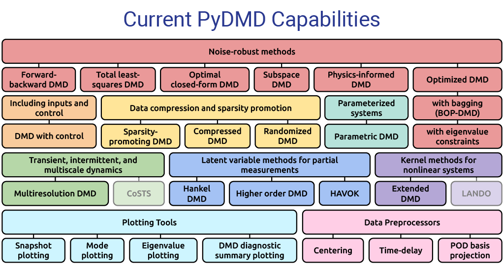
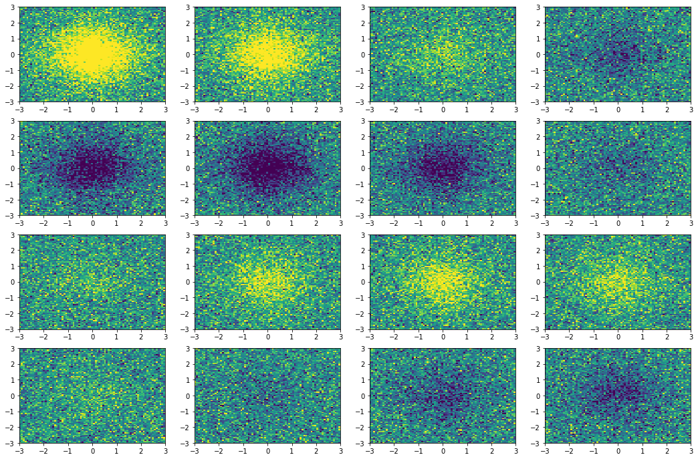
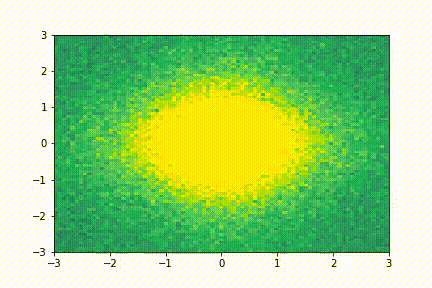
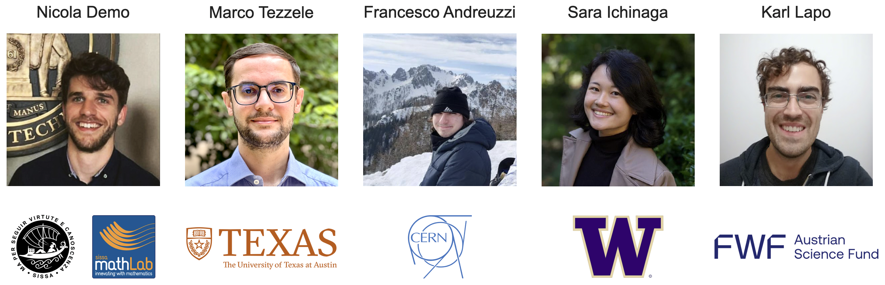
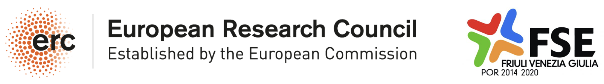

<p align="center">
  <a href="http://mathlab.github.io/PyDMD/" target="_blank" >
    
  </a>
</p>
<p align="center">
    <a href="https://doi.org/10.21105/joss.00530" target="_blank">
        
    </a>
    <a href="https://github.com/mathLab/PyDMD/blob/master/LICENSE" target="_blank">
        
    </a>
    <a href="https://badge.fury.io/py/pydmd"  target="_blank">
        
    </a>
    <a href="https://github.com/mathLab/PyDMD/actions/workflows/deploy_after_push.yml" target="_blank">
        
    </a>
    <a href="https://www.codacy.com/gh/mathLab/PyDMD/dashboard?utm_source=github.com&amp;utm_medium=referral&amp;utm_content=mathLab/PyDMD&amp;utm_campaign=Badge_Coverage">
      
    </a>
    <a href="https://www.codacy.com/gh/mathLab/PyDMD/dashboard?utm_source=github.com&amp;utm_medium=referral&amp;utm_content=mathLab/PyDMD&amp;utm_campaign=Badge_Grade">
      
    </a>
</p>


**PyDMD**: Python Dynamic Mode Decomposition

## Table of contents
* [Description](#description)
* [Dependencies and installation](#dependencies-and-installation)
	* [Installing via PIP](#installing-via-pip)
	* [Installing from source](#installing-from-source)
* [Documentation](#documentation)
* [Testing](#testing)
* [Examples and Tutorials](#examples-and-tutorials)
* [Awards](#awards)
* [How to cite](#how-to-cite)
	* [References](#references)
	* [Recent works with PyDMD](#recent-works-with-pydmd)
* [Developers and contributors](#developers-and-contributors)
* [Funding](#funding)
* [License](#license)

## Description
**PyDMD** is a Python package that uses **Dynamic Mode Decomposition** for a data-driven model simplification based on spatiotemporal coherent structures.

Dynamic Mode Decomposition (DMD) is a model reduction algorithm developed by Schmid (see "Dynamic mode decomposition of numerical and experimental data"). Since then has emerged as a powerful tool for analyzing the dynamics of nonlinear systems. DMD relies only on the high-fidelity measurements, like experimental data and numerical simulations, so it is an equation-free algorithm. Its popularity is also due to the fact that it does not make any assumptions about the underlying system. See Kutz ("Dynamic Mode Decomposition: Data-Driven Modeling of Complex Systems") for a comprehensive overview of the algorithm and its connections to the Koopman-operator analysis, initiated in Koopman ("Hamiltonian systems and transformation in Hilbert space"), along with examples in computational fluid dynamics.

In the last years many variants arose, such as multiresolution DMD, compressed DMD, forward backward DMD, higher order DMD, and physics-informed DMD among others, in order to deal with noisy data, big dataset, or spurius data for example. We implemented in Python the majority of the DMD extensions currently present in the literature with a user friendly interface. We also provide many tutorials that show all the characteristics of the software. See the [**Examples**](#examples) section below and the [**Tutorials**](tutorials/README.md) to have an idea of the potential of this package.

<p align="center">
    
</p>


## Dependencies and installation
**PyDMD** requires requires `numpy`, `scipy`, `matplotlib`, `future`, `sphinx` (for the documentation) and `pytest` (for local test). The code is tested for Python 3, while compatibility of Python 2 is not guaranteed anymore. It can be installed using `pip` or directly from the source code.

### Installing via PIP
Mac and Linux users can install pre-built binary packages using pip.
To install the package just type:
```bash
> pip install pydmd
```
To uninstall the package:
```bash
> pip uninstall pydmd
```

### Installing from source
The official distribution is on GitHub, and you can clone the repository using
```bash
> git clone https://github.com/mathLab/PyDMD
```

To install the package just type:
```bash
> pip install -e .
```

To uninstall the package type:
```bash
> pip uninstall pydmd
```

## Documentation
**PyDMD** uses [Sphinx](http://www.sphinx-doc.org/en/stable/) for code documentation. You can view the documentation online [here](http://pydmd.github.io/PyDMD/). To build the html version of the docs locally simply:

```bash
> cd docs
> make html
```

The generated html can be found in `docs/build/html`. Open up the `index.html` you find there to browse.


## Testing

We are using GitHub actions for Continuous Integration. You can check the current status [here](https://github.com/mathLab/PyDMD/actions).

To run tests locally (`pytest` is required):

```bash
> pytest
```

## Examples and Tutorials
You can find useful tutorials on how to use the package in the [tutorials](tutorials/README.md) folder.

Here we show a simple application (taken from [tutorial 2](tutorials/tutorial2/tutorial-2-adv-dmd.ipynb)): we collect few snapshots from a toy system with some noise and reconstruct the entire system evolution.
<p align="center">

<em>The original snapshots used as input for the dynamic mode decomposition</em>
</p>

<p align="center">
</br>
<em>The system evolution reconstructed with dynamic mode decomposition</em>
</p>

## Awards

* First prize winner in **DSWeb 2019 Contest** _Tutorials on Dynamical Systems Software_ (Junior Faculty Category). You can read the winner tutorial (PDF format) in the [tutorials](tutorials/tutorial_dsweb.pdf) folder.

## How to cite
If you use this package in your publications please cite the package as follows:

Demo et al., (2018). PyDMD: Python Dynamic Mode Decomposition. Journal of Open Source Software, 3(22), 530, https://doi.org/10.21105/joss.00530

Or if you use LaTeX:
```tex
@article{demo18pydmd,
  Author = {Demo, Nicola and Tezzele, Marco and Rozza, Gianluigi},
  Title = {{PyDMD: Python Dynamic Mode Decomposition}},
  Journal = {The Journal of Open Source Software},
  Volume = {3},
  Number = {22},
  Pages = {530},
  Year = {2018},
  Doi = {https://doi.org/10.21105/joss.00530}
}
```

### References
To implement the various versions of the DMD algorithm we follow these works:

* Kutz, Brunton, Brunton, Proctor. *Dynamic Mode Decomposition: Data-Driven Modeling of Complex Systems*. SIAM Other Titles in Applied Mathematics, 2016. [[DOI](https://doi.org/10.1137/1.9781611974508)] [[bibitem](readme/Kutz2016_1.bib)].
* Gavish, Donoho. *The optimal hard threshold for singular values is 4/sqrt(3)*. IEEE Transactions on Information Theory, 2014. [[DOI](https://doi.org/10.1109/TIT.2014.2323359)] [[bibitem](readme/Gavish2014.bib)].
* Matsumoto, Indinger. *On-the-fly algorithm for Dynamic Mode Decomposition using Incremental Singular Value Decomposition and Total Least Squares*. 2017. [[arXiv](https://arxiv.org/abs/1703.11004)] [[bibitem](readme/Matsumoto2017.bib)].
* Hemati, Rowley, Deem, Cattafesta. *De-biasing the dynamic mode decomposition for applied Koopman spectral analysis of noisy datasets*. Theoretical and Computational Fluid Dynamics, 2017. [[DOI](https://doi.org/10.1007/s00162-017-0432-2)] [[bibitem](readme/Hemati2017.bib)].
* Dawson, Hemati, Williams, Rowley. *Characterizing and correcting for the effect of sensor noise in the dynamic mode decomposition*. Experiments in Fluids, 2016. [[DOI](https://doi.org/10.1007/s00348-016-2127-7)] [[bibitem](readme/Dawson2016.bib)].
* Kutz, Fu, Brunton. *Multiresolution Dynamic Mode Decomposition*. SIAM Journal on Applied Dynamical Systems, 2016. [[DOI](https://doi.org/10.1137/15M1023543)] [[bibitem](readme/Kutz2016_2.bib)].
* Erichson, Brunton, Kutz. *Compressed dynamic mode decomposition for background modeling*. Journal of Real-Time Image Processing, 2016. [[DOI](https://doi.org/10.1007/s11554-016-0655-2)] [[bibitem](readme/Erichson2016.bib)].
* Le Clainche, Vega. *Higher Order Dynamic Mode Decomposition*. Journal on Applied Dynamical Systems, 2017. [[DOI](https://doi.org/10.1137/15M1054924)] [[bibitem](readme/LeClainche2017.bib)].
* Andreuzzi, Demo, Rozza. *A dynamic mode decomposition extension for the forecasting of parametric dynamical systems*. 2021.  [[arXiv](https://arxiv.org/pdf/2110.09155)] [[bibitem](readme/Andreuzzi2021.bib)].
* Jovanović, Schmid, Nichols *Sparsity-promoting dynamic mode decomposition*. 2014.  [[arXiv](https://arxiv.org/abs/1309.4165)] [[bibitem](readme/Jovanovic2014.bib)].

### Recent works with PyDMD
Here there is a list of the scientific works involving **PyDMD** you can consult and/or cite. If you want to add one, please open a PR.

* Tezzele, Demo, Rozza. *A non-intrusive approach for proper orthogonal decomposition modal coefficients reconstruction through active subspaces*. Comptes Rendus de l'Academie des Sciences DataBEST 2019 Special Issue. [[arXiv](https://arxiv.org/abs/1907.12777)] .

* Tezzele, Demo, Rozza. *Shape Optimization through Proper Orthogonal Decomposition with Interpolation and Dynamic Mode Decomposition Enhanced by Active Subspaces*. In The Proceedings of VIII International Conference on Computational Methods in Marine Engineering, pages 122–133, 2019. [[DOI](https://congress.cimne.com/marine2019/frontal/Doc/EbookMarine2019.pdf)] [[arXiv](https://arxiv.org/abs/1905.05483)].

* Tezzele, Demo, Mola, Rozza. *An integrated data-driven computational pipeline with model order reduction for industrial and applied mathematics*. Submitted, 2018. [[arXiv](https://arxiv.org/abs/1810.12364)].

* Demo, Tezzele, Gustin, Lavini, Rozza. *Shape optimization by means of proper orthogonal decomposition and dynamic mode decomposition*. In Technology and Science for the Ships of the Future: Proceedings of NAV 2018: 19th International Conference on Ship & Maritime Research, 2018. [[DOI](https://doi.org/10.3233/978-1-61499-870-9-212)] [[arXiv](https://arxiv.org/abs/1803.07368)].

* Tezzele, Demo, Gadalla, Mola, Rozza. *Model Order Reduction by means of Active Subspaces and Dynamic Mode Decomposition for Parametric Hull Shape Design Hydrodynamics*. In Technology and Science for the Ships of the Future: Proceedings of NAV 2018: 19th International Conference on Ship & Maritime Research, 2018. [[DOI](https://doi.org/10.3233/978-1-61499-870-9-569)] [[arXiv](https://arxiv.org/abs/1803.07377)].

* Demo, Tezzele, Mola, Rozza. *An efficient shape parametrisation by free-form deformation enhanced by active subspace for hull hydrodynamic ship design problems in open source environment*. 2018. [[arXiv](https://arxiv.org/abs/1801.06369)].

* Tezzele, Demo, Stabile, Mola, Rozza. *Enhancing CFD predictions in shape design problems by model and parameter space reduction*. 2020. [[arXiv](https://arxiv.org/abs/2001.05237)].

* Tezzele. *Data-driven parameter and model order reduction for industrial optimisation problems with applications in naval engineering*, PhD Thesis. 2021. [[Iris](http://hdl.handle.net/20.500.11767/124569)].

## Developers and contributors
The main developers are 
<p align="center">
    
</p>

We warmly thank all the contributors that have supported PyDMD!

Do you want to join the team? Read the [Contributing guidelines](.github/CONTRIBUTING.md) and the [Tutorials for Developers](tutorials#tutorials-for-developers) before starting to play!


<a href="https://github.com/mathLab/PyDMD/graphs/contributors">
  
</a>

Made with [contrib.rocks](https://contrib.rocks).


## Funding
A significant part of PyDMD has been written either as a by-product for other projects people were funded for, or by people on university-funded positions. There are probably many of such projects that have led to some development of PyDMD. We are very grateful for this support!

Beyond this, PyDMD has also been supported by some dedicated projects that have allowed us to work on extensions, documentation, training and dissemination that would otherwise not have been possible. In particular, we acknowledge the following sources of support with great gratitude:

* [H2020 ERC CoG 2015 AROMA-CFD project 681447](https://people.sissa.it/~grozza/aroma-cfd/), P.I. Professor [Gianluigi Rozza](https://people.sissa.it/~grozza) at [SISSA mathLab](https://mathlab.sissa.it/).
* FSE HEaD project [Bulbous Bow Shape Optimization through Reduced Order Modelling](https://mathlab.sissa.it/project/ottimizzazione-di-forme-prodiere-e-poppiere-di-carena-mediante-luso-di-algoritmi-parametrici), FVG, Italy.
<p align="center">
    
</p>

## License

See the [LICENSE](LICENSE.rst) file for license rights and limitations (MIT).
