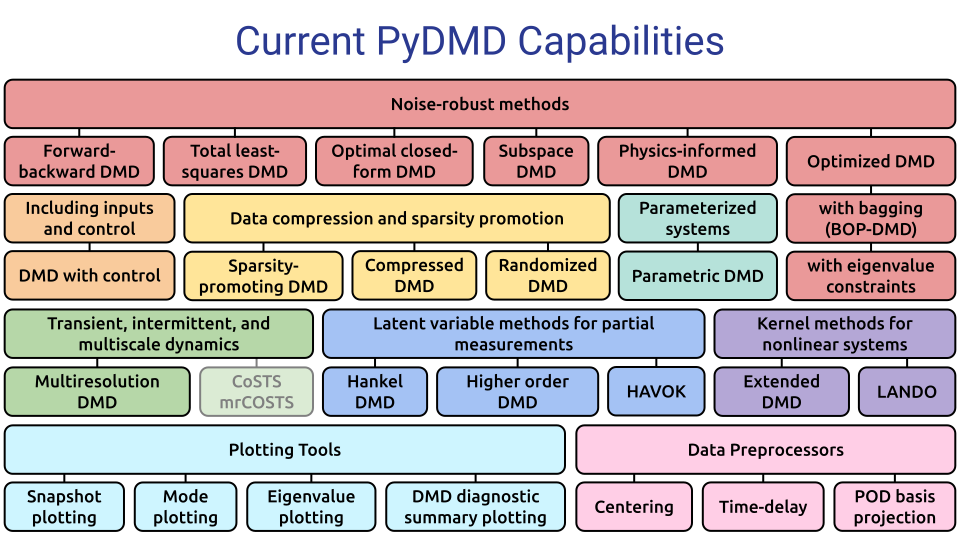

<p align="center">
  <a href="http://pydmd.github.io/PyDMD/" target="_blank" >
    
  </a>
</p>
<p align="center">
    <a href="http://pydmd.github.io/PyDMD" target="_blank">
        
    </a>
    <a href="https://pypi.org/project/pydmd/" target="_blank">
        
    </a>
    <a href="#dependencies-and-installation" target="_blank">
        
    </a>
    <a href="https://github.com/PyDMD/PyDMD/blob/master/LICENSE" target="_blank">
        
    </a>
    <br>
    <a href="https://github.com/PyDMD/PyDMD/actions/workflows/deploy_after_push.yml" target="_blank">
        
    </a>
    <a href="https://app.codacy.com/gh/PyDMD/PyDMD/dashboard?utm_source=gh&utm_medium=referral&utm_content=&utm_campaign=Badge_coverage" target="_blank">
      
    </a>
    <a href="https://app.codacy.com/gh/PyDMD/PyDMD/dashboard?utm_source=gh&utm_medium=referral&utm_content=&utm_campaign=Badge_grade" target="_blank">
      
    </a>
    <a href="https://github.com/ambv/black" target="_blank">
      
    </a>
    <br>
    <a href="#developers-and-contributors">
      
    </a>
    <a href="#stargazers">
      
    </a>
    <a href="#dependencies-and-installation" target="_blank">
        
    </a>
    <a href="https://doi.org/10.21105/joss.00530" target="_blank">
        
    </a>
</p>

## Table of contents
* [Description](#description)
* [Dependencies and installation](#dependencies-and-installation)
* [Quickstart guide](#quickstart-guide)
* [Awards](#awards)
* [Citing PyDMD](#citing-pydmd)
* [References](#references)
* [Developers and contributors](#developers-and-contributors)
* [Funding](#funding)
* [Affiliations](#affiliations)

## Description

**PyDMD** is a Python package designed for **Dynamic Mode Decomposition (DMD)**, a data-driven method used for analyzing and extracting spatiotemporal coherent structures from time-varying datasets. It provides a comprehensive and user-friendly interface for performing DMD analysis, making it a valuable tool for researchers, engineers, and data scientists working in various fields.

With PyDMD, users can easily decompose complex, high-dimensional datasets into a set of coherent spatial and temporal modes, capturing the underlying dynamics and extracting important features. The package implements both standard DMD algorithms and advanced variations, enabling users to choose the most suitable method for their specific needs. These extensions allow to deal with noisy data, big dataset, control variables, or to impose physical structures.

PyDMD offers a seamless integration with the scientific Python ecosystem, leveraging popular libraries such as NumPy and SciPy for efficient numerical computations and data manipulation. It also offers a variety of visualization tools, including mode reconstruction, energy spectrum analysis, and time evolution plotting. These capabilities enable users to gain insights into the dominant modes of the system, identify significant features, and understand the temporal evolution of the dynamics.

PyDMD promotes ease of use and customization, providing a well-documented API with intuitive function names and clear parameter descriptions. The package is actively maintained and updated, ensuring compatibility with the latest Python versions and incorporating user feedback to improve functionality and performance. We provide many tutorials showing the characteristics of the software. See the [**Examples**](#examples-and-tutorials) section below and the [**Tutorials**](tutorials/README.md) to have an idea of the potential of this package. Also see the diagram below for a summary of all available tools and functionalities. Currently in-progress contributions are represented by semi-transparent boxes.

<p align="center">
    
</p>

## Dependencies and installation

### Installing via PIP
PyDMD is available on [PyPI](https://pypi.org/project/pydmd), therefore you can install the latest released version with:
```bash
> pip install pydmd
```

### Installing from source
To install the bleeding edge version, clone this repository with:
```bash
> git clone https://github.com/PyDMD/PyDMD
```

and then install the package in [development mode](https://setuptools.pypa.io/en/latest/userguide/development_mode.html):
```bash
> pip install -e .
```

### Dependencies
The core features of **PyDMD** depend on `numpy` and `scipy`. In order to use the plotting functionalities you will also need `matplotlib`.

## Quickstart Guide
To perform DMD, simply begin by initializing a PyDMD module that implements your DMD method of choice. Models may then be fitted by calling the `fit()` method and passing in the necessary data. This step performs the DMD algorithm, after which users may use PyDMD plotting tools in order to visualize their results.

```python3
from pydmd import DMD
from pydmd.plotter import plot_summary

# Build an exact DMD model with 15 spatiotemporal modes.
dmd = DMD(svd_rank=15)

# Fit the DMD model.
# X = (n, m) numpy array of time-varying snapshot data.
dmd.fit(X)

# Plot a summary of the key spatiotemporal modes.
plot_summary(dmd)
```

PyDMD modules can also be wrapped with data preprocessors if desired. These wrappers will preprocess the data and postprocess data reconstructions automatically.
```python3
from pydmd import DMD
from pydmd.preprocessing import zero_mean_preprocessing

# Build and fit an exact DMD model with data centering.
centered_dmd = zero_mean_preprocessing(DMD(svd_rank=15))
centered_dmd.fit(X)
```

Users may also build highly complex DMD models with PyDMD. Below is an example of how one might build and fit a customized Optimized DMD model with bagging, eigenvalue constraints, and custom variable projection arguments.
```python3
from pydmd import BOPDMD

# Build a bagging, optimized DMD (BOP-DMD) model.
# For Optimized DMD (without bagging), use BOPDMD(svd_rank=15, num_trials=0).
bopdmd = BOPDMD(
    svd_rank=15,                                  # Rank of the DMD fit.
    num_trials=100,                               # Number of bagging trials to perform.
    trial_size=0.5,                               # Use 50% of the total number of snapshots per trial.
    eig_constraints={"imag", "conjugate_pairs"},  # Eigenvalues must be imaginary and conjugate pairs.
    varpro_opts_dict={"tol":0.2, "verbose":True}, # Set convergence tolerance and use verbose updates.
)

# Fit the BOP-DMD model.
# X = (n, m) numpy array of time-varying snapshot data
# t = (m,) numpy array of times of data collection
bopdmd.fit(X, t)
```

PyDMD modules and functions may be parameterized by a variety of inputs for added customization, so we generally recommend that new users refer to our [documentation](https://pydmd.github.io/PyDMD/code.html), and to our module-specific [tutorials](tutorials/README.md) for more examples and information.

Also provided below is an example call to the `plot_summary()` function when given a DMD model fitted to mean-centered flow past a cylinder data available at <ins>dmdbook.com/DATA.zip</ins>. A rank-12 exact DMD model was used to generate this figure. Eigenvalues, modes, and dynamics are color-coded to indicate associations. Eigenvalue marker sizes also indicate spatiotemporal mode amplitudes or importance.

Plotter documentation can be found [here](https://pydmd.github.io/PyDMD/plotter.html).
```python3
from pydmd.plotter import plot_summary

plot_summary(
    dmd, # <-- Fitted PyDMD model. Can be DMD, BOPDMD, etc.
    figsize=(12, 7),
    index_modes=(0, 2, 4),
    snapshots_shape=(449, 199),
    order="F",
    mode_cmap="seismic",
    dynamics_color="k",
    flip_continuous_axes=True,
    max_sval_plot=30,
)
```
<p align="center">
  </br>
  <em>Sample output of the plot_summary function.</em>
</p>

For users who are unsure of which DMD method is best for them, we provide the following flow chart, which outlines how one might choose an appropriate DMD variant based on specific problem types or data sets.

<p align="center">
    
</p>

## Awards

First prize winner in **DSWeb 2019 Contest** _Tutorials on Dynamical Systems Software_ (Junior Faculty Category). You can read the winner tutorial (PDF format) in the [tutorials](tutorials/tutorial_dsweb.pdf) folder.

## Citing PyDMD
When citing PyDMD, please cite both of the following references:
* Demo, Tezzele, Rozza. *PyDMD: Python Dynamic Mode Decomposition*. Journal of Open Source Software, 2018. [[DOI](https://doi.org/10.21105/joss.00530)][[bibitem](readme/refs/Demo2018)]
* Ichinaga, Andreuzzi, Demo, Tezzele, Lapo, Rozza, Brunton, Kutz. *PyDMD: A Python package for robust dynamic mode decomposition*. arXiv preprint, 2024. [[arXiv](https://doi.org/10.48550/arXiv.2402.07463)]

## References
To implement the various versions of the DMD algorithm we follow these works:

### General DMD References
* Kutz, Brunton, Brunton, Proctor. *Dynamic Mode Decomposition: Data-Driven Modeling of Complex Systems*. SIAM Other Titles in Applied Mathematics, 2016. [[DOI](https://doi.org/10.1137/1.9781611974508)] [[bibitem](readme/refs/Kutz2016_1.bib)].
* Schmid. *Dynamic mode decomposition of numerical and experimental data*. Journal of Fluid Mechanics, 2010. [[DOI](https://doi.org/10.1017/S0022112010001217)][[bibitem](readme/refs/Schmid2010)]
* Tu, Rowley, Luchtenburg, Brunton, Kutz. *On Dynamic Mode Decomposition: Theory and Applications*. Journal of Computational Dynamics, 2014. [[DOI](https://doi.org/10.3934/jcd.2014.1.391)][[bibitem](readme/refs/Tu2014.bib)]
* Schmid. *Dynamic mode decomposition and its variants*. Annual Review of Fluid Mechanics, 2022. [[DOI](https://doi.org/10.1146/annurev-fluid-030121-015835)][[bibitem](readme/refs/Schmid2022)]

### DMD Variants: Noise-robust Methods
* **Forward-backward DMD:** Dawson, Hemati, Williams, Rowley. *Characterizing and correcting for the effect of sensor noise in the dynamic mode decomposition*. Experiments in Fluids, 2016. [[DOI](https://doi.org/10.1007/s00348-016-2127-7)] [[bibitem](readme/refs/Dawson2016.bib)].
* **Total least-squares DMD:** Hemati, Rowley, Deem, Cattafesta. *De-biasing the dynamic mode decomposition for applied Koopman spectral analysis of noisy datasets*. Theoretical and Computational Fluid Dynamics, 2017. [[DOI](https://doi.org/10.1007/s00162-017-0432-2)] [[bibitem](readme/refs/Hemati2017.bib)].
* **Optimal closed-form DMD:** Héas, Herzet. *Low-rank dynamic mode decomposition: An exact and tractable solution*. Journal of Nonlinear Science, 2022. [[DOI](https://doi.org/10.1007/s00332-021-09770-w)] [[bibitem](readme/refs/Heas2022.bib)].
* **Subspace DMD:** Takeishi, Kawahara, Yairi. *Subspace dynamic mode decomposition for stochastic Koopman analysis*. Physical Review E, 2017. [[DOI](https://doi.org/10.1103/PhysRevE.96.033310)] [[bibitem](readme/refs/Takeishi2017.bib)].
* **Physics-informed DMD:** Baddoo, Herrmann, McKeon, Kutz, Brunton. *Physics-informed dynamic mode decomposition*. Proceedings of the Royal Society A, 2023. [[DOI](https://doi.org/10.1098/rspa.2022.0576)] [[bibitem](readme/refs/Baddoo2023.bib)].
* **Optimized DMD:** Askham, Kutz. *Variable projection methods for an optimized dynamic mode decomposition*. SIAM Journal on Applied Dynamical Systems, 2018. [[DOI](https://doi.org/10.1137/M1124176)] [[bibitem](readme/refs/Askham2018.bib)].
* **Bagging, optimized DMD:** Sashidhar, Kutz. *Bagging, optimized dynamic mode decomposition for robust, stable forecasting with spatial and temporal uncertainty quantification*. Proceedings of the Royal Society A, 2022. [[DOI](https://doi.org/10.1098/rsta.2021.0199)] [[bibitem](readme/refs/Sashidhar2022.bib)].

### DMD Variants: Additional Methods and Extensions
* **DMD with Control:** Proctor, Brunton, Kutz. *Dynamic mode decomposition with control*. SIAM Journal on Applied Dynamical Systems, 2016. [[DOI](https://doi.org/10.1137/15M1013857)] [[bibitem](readme/refs/Proctor2016.bib)].
* **Multiresolution DMD:** Kutz, Fu, Brunton. *Multiresolution dynamic mode decomposition*. SIAM Journal on Applied Dynamical Systems, 2016. [[DOI](https://doi.org/10.1137/15M1023543)] [[bibitem](readme/refs/Kutz2016_2.bib)].
* **Sparsity-promoting DMD:** Jovanović, Schmid, Nichols *Sparsity-promoting dynamic mode decomposition*. Physics of Fluids, 2014. [[DOI](https://doi.org/10.1063/1.4863670)] [[bibitem](readme/refs/Jovanovic2014.bib)].
* **Compressed DMD:** Erichson, Brunton, Kutz. *Compressed dynamic mode decomposition for background modeling*. Journal of Real-Time Image Processing, 2016. [[DOI](https://doi.org/10.1007/s11554-016-0655-2)] [[bibitem](readme/refs/Erichson2016.bib)].
* **Randomized DMD:** Erichson, Mathelin, Kutz, Brunton. *Randomized dynamic mode decomposition*. SIAM Journal on Applied Dynamical Systems, 2019. [[DOI](https://doi.org/10.1137/18M1215013)] [[bibitem](readme/refs/Erichson2019.bib)].
* **Higher Order DMD:** Le Clainche, Vega. *Higher order dynamic mode decomposition*. Journal on Applied Dynamical Systems, 2017. [[DOI](https://doi.org/10.1137/15M1054924)] [[bibitem](readme/refs/LeClainche2017.bib)].
* **HAVOK:** Brunton, Brunton, Proctor, Kaiser, Kutz. *Chaos as an intermittently forced linear system*. Nature Communications, 2017. [[DOI](https://doi.org/10.1038/s41467-017-00030-8)] [[bibitem](readme/refs/Brunton2017.bib)].
* **Parametric DMD:** Andreuzzi, Demo, Rozza. *A dynamic mode decomposition extension for the forecasting of parametric dynamical systems*. SIAM Journal on Applied Dynamical Systems, 2023.  [[DOI](https://doi.org/10.1137/22M1481658)] [[bibitem](readme/refs/Andreuzzi2021.bib)].
* **Extended DMD:** Williams, Rowley, Kevrekidis. *A kernel-based method for data-driven koopman spectral analysis*. Journal of Computational Dynamics, 2015. [[DOI](https://doi.org/10.3934/jcd.2015005)] [[bibitem](readme/refs/Williams2015.bib)].
* **LANDO:** Baddoo, Herrmann, McKeon, Brunton. *Kernel learning for robust dynamic mode decomposition: linear and nonlinear disambiguation optimization*. Proceedings of the Royal Society A, 2022. [[DOI](https://doi.org/10.1098/rspa.2021.0830)] [[bibitem](readme/refs/Baddoo2022.bib)].
* **DMD with Centering:** Hirsh, Harris, Kutz, Brunton. *Centering data improves the dynamic mode decomposition*. SIAM Journal on Applied Dynamical Systems, 2020. [[DOI](https://doi.org/10.1137/19M1289881)] [[bibitem](readme/refs/Hirsh2020.bib)]

### General Implementation Tools
* Gavish, Donoho. *The optimal hard threshold for singular values is 4/sqrt(3)*. IEEE Transactions on Information Theory, 2014. [[DOI](https://doi.org/10.1109/TIT.2014.2323359)] [[bibitem](readme/refs/Gavish2014.bib)].
* Matsumoto, Indinger. *On-the-fly algorithm for dynamic mode decomposition using incremental singular value decomposition and total least squares*. 2017. [[arXiv](https://arxiv.org/abs/1703.11004)] [[bibitem](readme/refs/Matsumoto2017.bib)].

### Recent works using PyDMD
You can find a list of the scientific works using **PyDMD** [here](https://scholar.google.com/scholar?oi=bibs&hl=en&cites=5544023489671534143).

## Developers and contributors
The main developers are 
<p align="center">
    
</p>

We warmly thank all the contributors that have supported PyDMD!

Do you want to join the team? Read the [Contributing guidelines](.github/CONTRIBUTING.md) and the [Tutorials for Developers](tutorials#tutorials-for-developers) before starting to play!

<a href="https://github.com/PyDMD/PyDMD/graphs/contributors">
  
</a>

Made with [contrib.rocks](https://contrib.rocks).

### Testing
We use `pytest` to run our unit tests. You can run the whole test suite by using the following command in the base directory of the repository:
```bash
pytest
```

## Funding
A significant part of PyDMD has been written either as a by-product for other projects people were funded for, or by people on university-funded positions. There are probably many of such projects that have led to some development of PyDMD. We are very grateful for this support!

Beyond this, PyDMD has also been supported by some dedicated projects that have allowed us to work on extensions, documentation, training and dissemination that would otherwise not have been possible. In particular, we acknowledge the following sources of support with great gratitude:

* [H2020 ERC CoG 2015 AROMA-CFD project 681447](https://people.sissa.it/~grozza/aroma-cfd/), P.I. Professor [Gianluigi Rozza](https://people.sissa.it/~grozza) at [SISSA mathLab](https://mathlab.sissa.it/).
* FSE HEaD project [Bulbous Bow Shape Optimization through Reduced Order Modelling](https://mathlab.sissa.it/project/ottimizzazione-di-forme-prodiere-e-poppiere-di-carena-mediante-luso-di-algoritmi-parametrici), FVG, Italy.
<p align="center">
    
</p>

## Affiliations
<p align="center">
    <a href="https://numfocus.org/sponsored-projects/affiliated-projects">
        
    </a>
</p>
